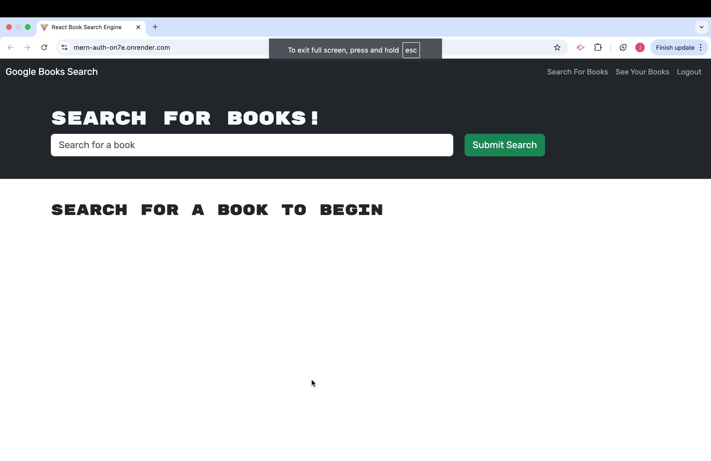
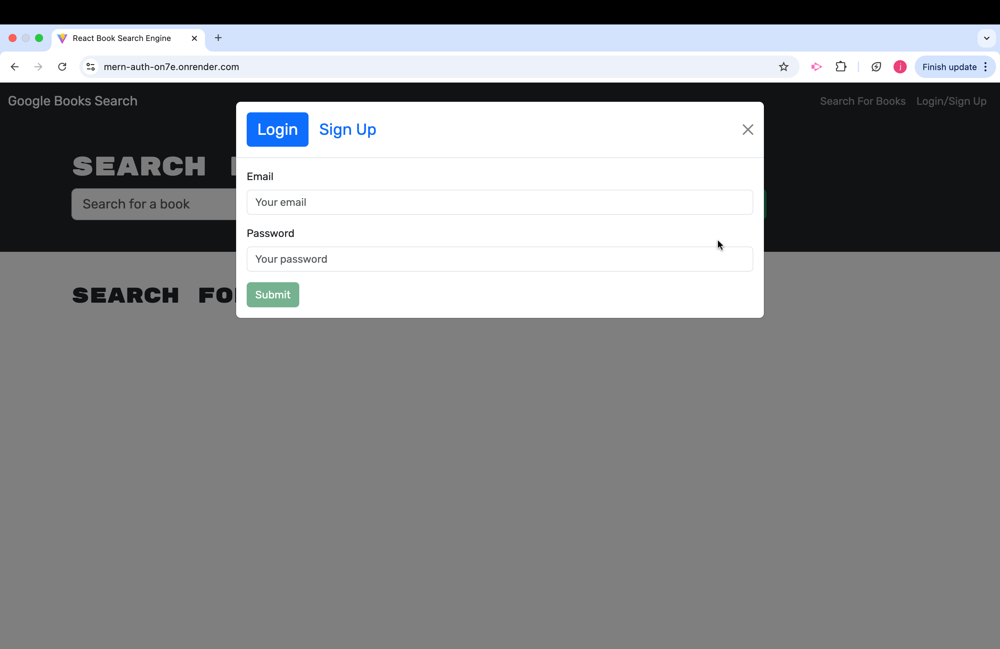
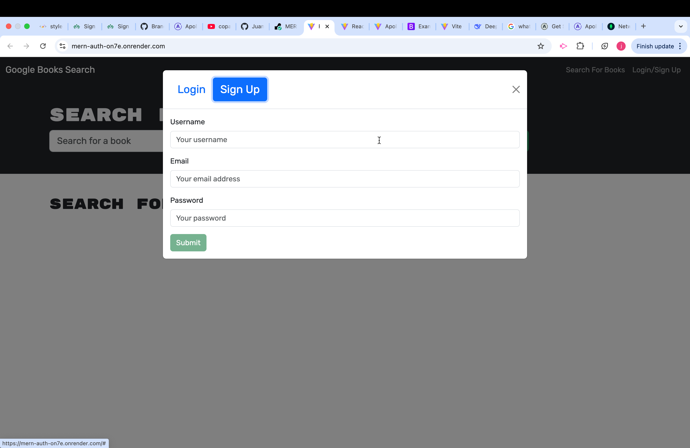
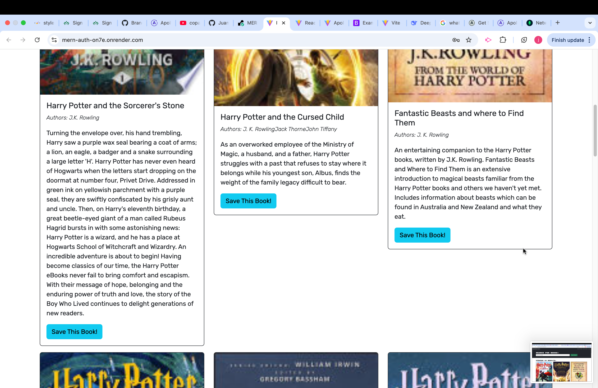
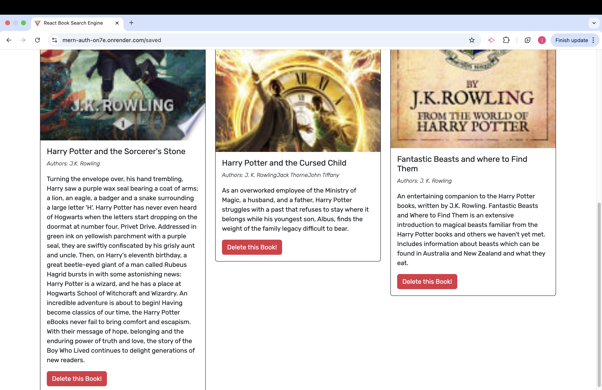

# MERN Authentication System

## Description
This is a full-stack authentication system built using the MERN (MongoDB, Express.js, React, Node.js) stack. The application allows users to register, log in, and access protected routes using JWT-based authentication.












## **Table of Contents**
- [Description](#description)
- [Features](#features)
- [Technologies Used](#technologies-used)
- [Installation](#installation)
- [Usage](#usage)
- [Database Schema](#database-schema)
- [Seeds](#seeds)
- [API Endpoints](#api-endpoints)
- [Walkthrough Video](#walkthrough-video)
- [DeployWeb](#depolyweb)
- [License](#license)

---

## Features
- User registration and login
- JWT-based authentication
- Protected routes
- Persistent user sessions
- API endpoints for authentication
- Frontend built with React
- Backend built with Node.js and Express.js
- MongoDB database for user data storage

## Technologies Used
- **Frontend:** React, React Router, Bootstrap
- **Backend:** Node.js, Express.js, MongoDB, Mongoose, JWT
- **Database:** MongoDB
- **Tools:** Postman/Insomnia for API testing, Render for deployment

## Installation
### Prerequisites
Ensure you have the following installed:
- Node.js (latest stable version)
- MongoDB (local or cloud-based)
- npm or yarn package manager

### Steps
1. Clone the repository:
   ```sh
   git clone https://github.com/yourusername/MERN-Auth.git
   cd MERN-Auth
   ```
2. Install dependencies for both backend and frontend:
   ```sh
   npm install
   ```
3. Set up the `.env` file:
   ```env
   MONGO_URI=your-mongodb-connection-string
   JWT_SECRET=your-secret-key
   ```
4. Start the backend server:
   ```sh
   npm run server
   ```
5. Start the frontend React application:
   ```sh
   npm run client
   ```

## Usage
- Start the backend server:
  ```sh
  npm run start
  ```
- Test API routes using Insomnia or Postman:
  - **Register a User:** `POST /api/users/register`
  - **Login:** `POST /api/users/login`
  - **Access Protected Route:** `GET /api/protected`

## Database Schema
```json
{
  "_id": "ObjectId",
  "username": "String",
  "email": "String",
  "password": "String (hashed)",
  "createdAt": "Date",
  "updatedAt": "Date"
}
```

## Seeds
To seed the database with initial users, run:
```sh
npm run seed
```

## API Endpoints
### User Authentication
- **POST** `/api/users/register` - Registers a new user.
  - **Required fields:** `username`, `email`, `password`.
- **POST** `/api/users/login` - Authenticates a user and returns a JWT token.
  - **Required fields:** `email`, `password`.

### Protected Routes
- **GET** `/api/protected` - Fetches protected user data (requires authentication).

## Walkthrough Video

[Watch the walkthrough video](https://drive.google.com/file/d/16QDp7CGrm-l3IBerdeqQzrc2WWzS8ipf/view)

## DeployWeb
- **Render Live Website:** [Deployed Application](https://mern-auth-on7e.onrender.com)

## License
This project is licensed under the **MIT License**.
